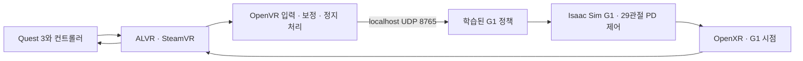

# vr_teleop — G1 · Quest 3 · ALVR

Meta Quest 3의 머리·기본 컨트롤러 입력으로 **Isaac Sim 속 G1 29관절 정책**을 실행하는 연구용 코드다. ALVR/SteamVR 입력, 기준 자세 보정, 학습된 정책 추론, 실제 시뮬레이션 관절 제어와 G1 시점 XR 구성을 포함한다.

기존 브라우저 입력 진단은 [WebXR 안내](docs/WEBXR_PROBE.md)에 보존했다. 이번 G1 경로는 브라우저 입력에 의존하지 않는다. bHaptics와 실제 하드웨어 G1 제어는 이번 범위에 포함하지 않는다.



## 먼저 읽기

- [설치와 공용 서버 이전](docs/g1/INSTALL.md)
- [학습·재개·평가와 Teacher/Student 설정](docs/g1/TRAINING.md)
- [ALVR 입력과 컨트롤러 조작](docs/g1/ALVR.md)
- [G1 모델·관절·PD·좌표 계약](docs/g1/ROBOT.md)
- [H1 → G1 동작 리타게팅](docs/g1/MOTION.md)
- [평가 방법과 지표](docs/g1/VALIDATION_METHOD.md)
- [기존 환경 보존과 변경 기록](docs/g1/CHANGELOG.md)

실제 학습 횟수·평가 수치·최종 모델 선택은 별도 결과 보고서와 모델 폴더의 `result.json`을 기준으로 확인한다. 입력 테스트나 3회 PPO 실행을 사전학습 완료로 취급하지 않는다. 실제 Quest 연결·화면 검증과 가상 입력을 통한 시뮬레이션 검증은 구분한다.

## 실행 환경

Ubuntu 22.04, Python 3.10, Isaac Sim 4.5.0.0, Isaac Lab commit `91ad4944f2b7fad29d52c04a5264a082bcaad71d`, PyTorch 2.5.1+cu121, RSL-RL 2.3.3을 사용한다. 개발 GPU는 RTX 4090 24GB다. 환경 기록은 `config/g1/`에 있다.

기존 정상 동작 환경을 복제해서 설치하려면 다음과 같이 실행한다. 원래 환경, 시스템 CUDA, 드라이버, ALVR 설정은 유지한다. 대상 환경이 이미 존재하면 설치 스크립트는 덮어쓰지 않는다.

```bash
bash scripts/g1/setup.sh --source-env unitree_sim_env
export G1_PYTHON="$HOME/anaconda3/envs/g1_teleop/bin/python"
```

자세한 설치 선택지와 실제 검증 범위는 설치 문서를 따른다. G1 USD 전체 폴더가 필요하며, 원래 Unitree 파일을 보유한 경우 별도 복사한다.

```bash
python3 scripts/g1/assets.py --source /path/to/unitree_sim_isaaclab
# 원본 파일이 없으면 공식 고정 버전 ZIP에서 필요한 G1 폴더만 추출
python3 scripts/g1/assets.py --download
```

## 모델 전달과 실행

정책, 관절·좌표 설정, 데이터와 로봇 에셋을 담은 전달용 아카이브를 `bundle.py`로 검증하고 새 폴더에 푼다. `SHA256SUMS`와 아카이브 `.sha256`을 함께 보관한다. 모델의 SHA256 일치는 동작 성능이나 실제 Quest 연결 성공을 뜻하지 않는다.

```bash
python3 scripts/g1/bundle.py verify /path/to/g1_teleop_bundle.tar.gz
python3 scripts/g1/bundle.py unpack /path/to/g1_teleop_bundle.tar.gz --destination /path/to/new_g1_bundle
```

설치 문서의 실제 CLI 표기를 확인한다. 모델 폴더에는 `model.pt`, `policy.pt`, `policy.json`, `run_config.json`, `nominal_targets.json`이 함께 있어야 한다. 아래에서 `G1_MODEL`은 전달받은 모델 폴더다.

```bash
export G1_MODEL=/absolute/path/to/models/CHOSEN_MODEL

# 먼저 화면 없는 평가로 관절/PD/좌표 계약과 정책을 확인
bash scripts/g1/run.sh evaluate --headless --num-envs 64 --steps 3000 \
  --seed 2026 --checkpoint "$G1_MODEL/model.pt" --use-exported-policy

# 터미널 1: ALVR/SteamVR가 실행된 같은 서버에서 Quest 입력
.venv-alvr/bin/python scripts/g1/alvr_input.py \
  --backend openvr --nominal "$G1_MODEL/nominal_targets.json"

# 터미널 2: G1 제어와 Quest용 native XR 화면
export XR_RUNTIME_JSON="$HOME/.local/share/Steam/steamapps/common/SteamVR/steamxr_linux64.json"
test -f "$XR_RUNTIME_JSON"  # Steam 라이브러리가 다른 위치면 위 경로를 변경
bash scripts/g1/run.sh teleop --num-envs 1 --steps 0 --device cuda:0 --xr \
  --checkpoint "$G1_MODEL/model.pt" --use-exported-policy
```

실제 헤드셋이 없을 때는 입력 프로세스를 다음 명령으로 바꾸고, 시뮬레이터의 `--xr`를 빼서 통합 동작을 확인한다. 이것은 실제 Quest 연결 검증이 아니다.

```bash
.venv-alvr/bin/python scripts/g1/alvr_input.py \
  --backend synthetic --enable-synthetic --duration 60 \
  --nominal "$G1_MODEL/nominal_targets.json"
```

## 조작 범위

기준 자세 보정 후 머리·양손의 상대 위치를 로봇 목표점으로 변환한다. 머리 높이 변화는 앉기 명령에 반영하고, 균형과 하체 관절 동작은 정책이 생성한다. 헤드셋과 두 컨트롤러만으로 사람의 실제 발 위치나 무릎 자세를 복원하는 것은 아니다. 컨트롤러 자세 회전과 손가락을 그대로 복사하는 기능도 현재 정책에는 없다.

왼쪽 스틱은 전후·좌우 이동 속도, 오른쪽 스틱은 yaw 회전 명령 경로다. 현재 제공된 기본 동작 데이터는 제자리 동작이므로, **해당 모델의 별도 이동 평가가 통과한 범위에서만 이동 성능을 기대할 수 있다.** 학습되지 않은 속도 명령을 보행 성공으로 설명하지 않는다.

입력이 끊기면 이동 명령을 0으로 하고 현재 도달한 자세에서 균형 제어를 유지한다. 낙상·연결 끊김 뒤에는 새로 시작 조작을 해야 한다. 양손 그립을 놓거나 정지 버튼을 누르면 원격 목표 추종을 멈춘다. 상세 버튼은 ALVR 안내에 있다.

## 저장소 구조

| 경로 | 내용 |
|---|---|
| `g1_teleop/sim/` | 같은 G1 학습·평가·실행 환경과 XR 시점 |
| `g1_teleop/motion/` | G1 기구학, H1 리타게팅, 동작 로더 |
| `g1_teleop/vr/` | OpenVR, 컨트롤러 바인딩, UDP, 기록·재생 |
| `g1_teleop/training.py` | Sparse PPO, teacher, student 설정 |
| `scripts/g1/` | 설치, 학습, 평가, 텔레옵, 데이터, 전달용 묶음 |
| `tests/g1/` | 입력·좌표·실행 상태·리타게팅 검증 |
| `config/g1/` | 버전과 환경 기록 |
| `runs/` | 로컬 체크포인트·TensorBoard·평가·상태 추적, Git 기본 제외 |
| `data/`, `assets/`, `models/` | 데이터·에셋·배포 정책, 전달용 묶음으로 이전 |
| `quest3_probe.py` | 기존 WebXR 진단 기능 |

데이터와 코드의 출처 및 적용 조건은 각 문서와 `g1_teleop/motion/licenses/`에 있다. 원본 H1 제공 동작에서 파생한 데이터는 CC BY-NC 4.0 연구 범위를 따른다.
